# 🧩 Garganttua Core

**Garganttua Core** is the foundational framework of the Garganttua ecosystem. It provides a comprehensive suite of modular, low-level building blocks designed for building high-performance, enterprise-grade Java applications. With a focus on modularity, type safety, and developer experience, Garganttua Core offers essential capabilities for reflection, dependency injection, workflow orchestration, mapping, encryption, and runtime management.

## ⚠️ Disclaimer

This documentation is partially generated using AI and may not always reflect the exact implementation.
If you find anything incorrect or unclear in this documentation or its sub-sections, please let me know at jeremy.colombet@garganttua.com.

If you need additional information, code snippets, examples, or further explanations, feel free to reach out.

## 🎯 Key Features

- **Modular Architecture** - 20+ independent modules, each solving a specific technical concern
- **Dependency Injection** - Lightweight IoC container with context management and bean lifecycle
- **Runtime Workflows** - Sophisticated orchestration engine with steps and exception handling
- **Script Engine** - Scripting language with REPL console, retry logic, synchronization, and expression evaluation
- **Workflow Orchestration** - High-level DSL for composing multi-stage pipelines with script generation
- **Compile-Time Indexing** - Annotation processor for zero-overhead annotation discovery at startup
- **Advanced Reflection** - Type-safe reflection utilities with annotation scanning and dynamic binding
- **Declarative DSL** - Fluent builder APIs for creating domain-specific languages
- **Condition Engine** - Expressive DSL for defining and evaluating complex runtime conditions
- **Object Mapping** - Declarative field-level mapping with bidirectional support
- **Execution Chains** - Chain-of-responsibility pattern with fallback handling
- **Lifecycle Management** - Thread-safe state transitions and component lifecycle hooks
- **Native Image Support** - GraalVM compatibility with Maven plugin for native compilation
- **Zero Reflection at Runtime** - Optional compile-time code generation for optimal performance
- **Cryptography** - Secure encryption, hashing, and key management utilities

## 💡 Philosophy

Garganttua Core is built on three core principles:

1. **Modularity** - Use only what you need. Each module is independently versioned and has minimal dependencies.
2. **Performance** - Designed for high-throughput, low-latency scenarios with optional native compilation.
3. **Developer Experience** - Intuitive APIs, comprehensive documentation, and type-safe interfaces.

## Installation
<!-- AUTO-GENERATED-START -->
### Installation with Maven
```xml
<dependency>
    <groupId>com.garganttua</groupId>
    <artifactId>garganttua-core</artifactId>
    <version>2.0.0-ALPHA01</version>
</dependency>
```

### Actual version
2.0.0-ALPHA01

### Dependencies
 - `org.junit.jupiter:junit-jupiter-engine:test`
 - `org.slf4j:slf4j-api:provided`
 - `org.projectlombok:lombok:provided`

<!-- AUTO-GENERATED-END -->

## 🧠 Architecture Overview

Garganttua Core is organized into independent modules, each focusing on a specific technical concern:

<!-- AUTO-GENERATED-ARCHITECTURE-START -->
| Module | Description |
|:--|:--|
| [**garganttua-core**](././README.md) | Garganttua Core - Foundational Java framework for dependency injection, workflow orchestration, reflection utilities, and more. |
| \|- [**garganttua-bindings**](./garganttua-bindings/README.md) | Modules providing bindings to external libs and frameworks. |
| \|    \|- [**garganttua-mutex-redis**](./garganttua-bindings/garganttua-mutex-redis/README.md) | Distributed mutex over redis. |
| \|    \|- [**garganttua-reflections**](./garganttua-bindings/garganttua-reflections/README.md) | Annotation scanner implementation based on org.reflections:reflections |
| \|    \|- [**garganttua-spring**](./garganttua-bindings/garganttua-spring/README.md) | Spring framework integration for Garganttua Core modules. |
| \|- [**garganttua-bootstrap**](./garganttua-bootstrap/README.md) | Bootstrap and application initialization framework. |
| \|- [**garganttua-commons**](./garganttua-commons/README.md) | Shared components, interfaces, annotations, and exceptions. |
| \|- [**garganttua-condition**](./garganttua-condition/README.md) | DSL to define, combine, and evaluate runtime conditions. |
| \|- [**garganttua-crypto**](./garganttua-crypto/README.md) | Encryption, hashing, and secure key management utilities. |
| \|- [**garganttua-dsl**](./garganttua-dsl/README.md) | Declarative language and builder framework for Garganttua DSLs. |
| \|- [**garganttua-execution**](./garganttua-execution/README.md) | Task execution, orchestration, and fallback handling engine. |
| \|- [**garganttua-expression**](./garganttua-expression/README.md) | Advanced expression language for object supplying. |
| \|- [**garganttua-injection**](./garganttua-injection/README.md) | Dependency injection container with modular context support. |
| \|- [**garganttua-lifecycle**](./garganttua-lifecycle/README.md) | Abstract lifecycle management with thread-safe state transitions. |
| \|- [**garganttua-mapper**](./garganttua-mapper/README.md) | Declarative object-to-object mapping engine. |
| \|- [**garganttua-mutex**](./garganttua-mutex/README.md) | Thread-safe mutex synchronization with configurable acquisition strategies. |
| \|- [**garganttua-native**](./garganttua-native/README.md) | Low-level native integrations and system abstractions. |
| \|- [**garganttua-native-image-maven-plugin**](./garganttua-native-image-maven-plugin/README.md) | Maven plugin to build native images (GraalVM support). |
| \|- [**garganttua-reflection**](./garganttua-reflection/README.md) | Advanced reflection utilities for classes, methods, and annotations. |
| \|- [**garganttua-runtime**](./garganttua-runtime/README.md) | Runtime context management and lifecycle orchestration. |
| \|- [**garganttua-script**](./garganttua-script/README.md) | Scripting language engine with REPL console, variables, control flow, and expression evaluation. |
| \|- [**garganttua-script-maven-plugin**](./garganttua-script-maven-plugin/README.md) | Maven plugin to build JARs that can be included in Garganttua scripts (.gs files). Automatically adds Garganttua-Packages manifest attribute. |
| \|- [**garganttua-supply**](./garganttua-supply/README.md) | Object suppliers and contextual provisioning utilities. |
| \|- [**garganttua-workflow**](./garganttua-workflow/README.md) | High-level workflow orchestration DSL with multi-stage pipeline composition and script generation. |
| \|- [**garganttua-annotation-processor**](./garganttua-annotation-processor/README.md) | Compile-time annotation indexing for zero-overhead annotation discovery at runtime. |


<!-- AUTO-GENERATED-ARCHITECTURE-STOP -->

## 📚 Module Categories

### Foundation Modules

These modules provide the core infrastructure used by all other modules:

- **[garganttua-commons](./garganttua-commons/README.md)** - The central dependency containing shared interfaces, annotations, exceptions, and utilities. Over 100 files organized in 13 packages covering DI, runtime, reflection, and common patterns.

- **[garganttua-dsl](./garganttua-dsl/README.md)** - Builder pattern framework providing `IBuilder` and `ILinkedBuilder` interfaces for creating fluent, hierarchical DSLs throughout the ecosystem.

- **[garganttua-lifecycle](./garganttua-lifecycle/README.md)** - Thread-safe lifecycle management with hooks for `onStart()`, `onStop()`, `onInit()`, `onReload()`, and `onFlush()`.

- **[garganttua-supply](./garganttua-supply/README.md)** - Lazy object provisioning framework with suppliers for deferred object creation and contextual provisioning.

### Core Framework Modules

These modules implement the primary framework capabilities:

- **[garganttua-injection](./garganttua-injection/README.md)** - Lightweight dependency injection container supporting singleton and prototype scopes, property injection, provider methods, and child contexts.

- **[garganttua-runtime](./garganttua-runtime/README.md)** - Workflow orchestration engine with sequential step execution, conditional steps, exception handling, and fallback mechanisms. Supports both annotation-based and programmatic definitions.

- **[garganttua-reflection](./garganttua-reflection/README.md)** - Advanced reflection utilities providing annotation scanning, object graph navigation via dot-notation paths, and type-safe field/method/constructor binding.

- **[garganttua-execution](./garganttua-execution/README.md)** - Chain-of-responsibility implementation for sequential task processing with optional fallback handlers and configurable exception propagation.

- **[garganttua-condition](./garganttua-condition/README.md)** - Expressive DSL for building and evaluating runtime conditions with full boolean algebra support (AND, OR, XOR, NAND, NOR), custom predicates, and property extraction.

- **[garganttua-expression](./garganttua-expression/README.md)** - ANTLR4-based expression language supporting function calls, method invocations, constructors, and type-safe evaluation with supplier integration.

- **[garganttua-script](./garganttua-script/README.md)** - Scripting language engine with interactive REPL console, retry logic, synchronization primitives, and composable runtime steps with exception handling.

- **[garganttua-workflow](./garganttua-workflow/README.md)** - High-level orchestration DSL for composing multi-stage pipelines. Generates Garganttua Script code from a fluent builder API with automatic variable management, input/output mapping, and runtime stage filtering.

### Utility Modules

Specialized modules for specific technical needs:

- **[garganttua-mapper](./garganttua-mapper/README.md)** - Declarative object-to-object mapping with annotation-based rules, bidirectional mapping, and field-level transformation support.

- **[garganttua-crypto](./garganttua-crypto/README.md)** - Cryptography utilities for encryption, decryption, hashing, and secure key management.

### Integration Modules

Modules providing integration with external frameworks and tools:

- **[garganttua-bindings](./garganttua-bindings/README.md)** - Parent module for external framework integrations.
  - **[garganttua-reflections](./garganttua-bindings/garganttua-reflections/README.md)** - Annotation scanner implementation based on the Reflections library.
  - **[garganttua-spring](./garganttua-bindings/garganttua-spring/README.md)** - Spring Framework integration enabling Garganttua components within Spring applications.

### Build & Native Modules

Modules for build-time tooling and native compilation:

- **[garganttua-annotation-processor](./garganttua-annotation-processor/README.md)** - Compile-time annotation indexing processor. Generates index files in `META-INF/garganttua/index/` for zero-overhead annotation discovery at runtime, replacing expensive classpath scanning.

- **[garganttua-native](./garganttua-native/README.md)** - Low-level native integrations and system abstractions for platform-specific functionality.

- **[garganttua-native-image-maven-plugin](./garganttua-native-image-maven-plugin/README.md)** - Maven plugin for building GraalVM native images with automatic reflection configuration generation.

- **[garganttua-script-maven-plugin](./garganttua-script-maven-plugin/README.md)** - Maven plugin for packaging JARs for dynamic inclusion in scripts via `include()`.

## 🚀 Quick Start

### Basic Dependency Injection

```java
import com.garganttua.core.injection.*;

// Create a DI context
IDiContext context = new DiContextBuilder()
    .addBean(UserService.class)
    .addBean(UserRepository.class)
    .addProperty("app.name", "MyApp")
    .addProperty("app.version", "1.0.0")
    .build();

// Start lifecycle
context.onStart();

// Retrieve and use beans
UserService service = context.getBean(UserService.class);
service.registerUser("john.doe@example.com");

// Shutdown
context.onStop();
```

### Runtime Workflow

```java
import com.garganttua.core.runtime.*;
import com.garganttua.core.runtime.annotations.*;

@RuntimeDefinition(input = Order.class, output = OrderResult.class)
@Named("order-processing")
public class OrderProcessingRuntime {

    @Steps
    public List<Class<?>> steps = List.of(
        ValidateOrderStep.class,
        ProcessPaymentStep.class,
        SendConfirmationStep.class
    );
}

@Step
@Named("validate-order")
public class ValidateOrderStep {

    @Operation(abortOnUncatchedException = true)
    public void validateOrder(@Input Order order) {
        if (order.getAmount() <= 0) {
            throw new RuntimeException("Invalid order amount");
        }
    }
}

// Execute runtime
IRuntime<Order, OrderResult> runtime = ...;
IRuntimeResult<Order, OrderResult> result = runtime.execute(myOrder).orElseThrow();
```

### Condition Evaluation

```java
import static com.garganttua.core.condition.Conditions.*;
import static com.garganttua.core.supply.dsl.FixedSupplierBuilder.*;

// Define complex business rule
ICondition eligibilityCondition = and(
    isNotNull(userSupplier),
    custom(userSupplier, User::getAge, age -> age >= 18),
    custom(userSupplier, User::getCountry, country -> country.equals("US")),
    or(
        custom(userSupplier, User::isPremium, premium -> premium),
        custom(userSupplier, User::getAccountAge, age -> age > 365)
    )
).build();

// Evaluate
boolean isEligible = eligibilityCondition.evaluate();
```

### Executor Chain

```java
import com.garganttua.core.execution.*;

// Build processing chain
ExecutorChain<OrderRequest> chain = new ExecutorChain<>();

chain.addExecutor((order, next) -> {
    validateOrder(order);
    next.execute(order);
});

chain.addExecutor((order, next) -> {
    enrichOrder(order);
    next.execute(order);
}, (order, next) -> {
    // Fallback: use default values
    useDefaults(order);
    next.execute(order);
});

chain.addExecutor((order, next) -> {
    persistOrder(order);
    next.execute(order);
});

// Execute
chain.execute(myOrder);
```

### Object Mapping

```java
import com.garganttua.core.mapper.*;
import com.garganttua.core.mapper.annotations.*;

@ObjectMappingRule(source = UserDTO.class, target = User.class)
public class UserMapper {

    @FieldMappingRule(sourceField = "fullName", targetField = "name")
    public void mapName(UserDTO dto, User user) {
        user.setName(dto.getFullName().toUpperCase());
    }

    @FieldMappingRule(sourceField = "birthDate", targetField = "age")
    public void calculateAge(UserDTO dto, User user) {
        user.setAge(calculateAgeFromBirthDate(dto.getBirthDate()));
    }
}

// Use mapper
IMapper<UserDTO, User> mapper = new Mapper<>(UserMapper.class);
User user = mapper.map(userDTO);
```

## 🧭 Internal Dependencies

The module dependency structure follows these principles:

- **All modules depend on `garganttua-commons`** - The commons module provides shared interfaces and utilities.
- **No circular dependencies** - The dependency graph is strictly acyclic to prevent coupling issues.
- **Layered architecture** - Lower-level modules (dsl, supply, lifecycle) are used by higher-level ones (injection, runtime).
- **Optional integrations** - Binding modules are optional and can be excluded if not needed.

### Dependency Layers

1. **Foundation Layer** - commons, dsl, supply, lifecycle
2. **Infrastructure Layer** - reflection, condition, execution, annotation-processor
3. **Framework Layer** - injection, runtime, mapper, expression
4. **Application Layer** - script, workflow
5. **Integration Layer** - bindings (reflections, spring)
6. **Build Layer** - native, native-image-maven-plugin, script-maven-plugin

```mermaid
graph TD
    garganttua-bindings["garganttua-bindings"]
    garganttua-bootstrap["garganttua-bootstrap"]
    garganttua-commons["garganttua-commons"]
    garganttua-condition["garganttua-condition"]
    garganttua-core["garganttua-core"]
    garganttua-crypto["garganttua-crypto"]
    garganttua-dsl["garganttua-dsl"]
    garganttua-execution["garganttua-execution"]
    garganttua-expression["garganttua-expression"]
    garganttua-injection["garganttua-injection"]
    garganttua-lifecycle["garganttua-lifecycle"]
    garganttua-mapper["garganttua-mapper"]
    garganttua-mutex["garganttua-mutex"]
    garganttua-mutex-redis["garganttua-mutex-redis"]
    garganttua-native["garganttua-native"]
    garganttua-native-image-maven-plugin["garganttua-native-image-maven-plugin"]
    garganttua-reflection["garganttua-reflection"]
    garganttua-reflections["garganttua-reflections"]
    garganttua-runtime["garganttua-runtime"]
    garganttua-script["garganttua-script"]
    garganttua-script-maven-plugin["garganttua-script-maven-plugin"]
    garganttua-spring["garganttua-spring"]
    garganttua-supply["garganttua-supply"]
    garganttua-workflow["garganttua-workflow"]
    garganttua-annotation-processor["garganttua-annotation-processor"]

    garganttua-reflection --> garganttua-commons
    garganttua-reflection --> garganttua-supply
    garganttua-injection --> garganttua-lifecycle
    garganttua-injection --> garganttua-supply
    garganttua-injection --> garganttua-dsl
    garganttua-injection --> garganttua-reflection
    garganttua-injection --> garganttua-reflections
    garganttua-injection --> garganttua-native
    garganttua-mutex --> garganttua-commons
    garganttua-mutex --> garganttua-dsl
    garganttua-mutex --> garganttua-injection
    garganttua-mutex --> garganttua-reflections
    garganttua-runtime --> garganttua-commons
    garganttua-runtime --> garganttua-injection
    garganttua-runtime --> garganttua-execution
    garganttua-runtime --> garganttua-condition
    garganttua-runtime --> garganttua-reflections
    garganttua-runtime --> garganttua-native
    garganttua-native --> garganttua-commons
    garganttua-native --> garganttua-dsl
    garganttua-native --> garganttua-reflection
    garganttua-native --> garganttua-reflections
    garganttua-bootstrap --> garganttua-commons
    garganttua-bootstrap --> garganttua-injection
    garganttua-bootstrap --> garganttua-reflections
    garganttua-reflections --> garganttua-commons
    garganttua-spring --> garganttua-reflection
    garganttua-mutex-redis --> garganttua-mutex
    garganttua-native-image-maven-plugin --> garganttua-commons
    garganttua-native-image-maven-plugin --> garganttua-dsl
    garganttua-native-image-maven-plugin --> garganttua-native
    garganttua-native-image-maven-plugin --> garganttua-reflection
    garganttua-native-image-maven-plugin --> garganttua-reflections
    garganttua-condition --> garganttua-commons
    garganttua-condition --> garganttua-dsl
    garganttua-condition --> garganttua-supply
    garganttua-condition --> garganttua-reflections
    garganttua-lifecycle --> garganttua-commons
    garganttua-lifecycle --> garganttua-reflection
    garganttua-mapper --> garganttua-reflection
    garganttua-mapper --> garganttua-native
    garganttua-script --> garganttua-commons
    garganttua-script --> garganttua-runtime
    garganttua-script --> garganttua-expression
    garganttua-script --> garganttua-injection
    garganttua-script --> garganttua-reflections
    garganttua-script --> garganttua-bootstrap
    garganttua-script --> garganttua-condition
    garganttua-script-maven-plugin --> garganttua-commons
    garganttua-script-maven-plugin --> garganttua-reflection
    garganttua-script-maven-plugin --> garganttua-reflections
    garganttua-expression --> garganttua-commons
    garganttua-expression --> garganttua-injection
    garganttua-expression --> garganttua-reflections
    garganttua-dsl --> garganttua-commons
    garganttua-dsl --> garganttua-reflections
    garganttua-supply --> garganttua-commons
    garganttua-supply --> garganttua-dsl
    garganttua-execution --> garganttua-commons
    garganttua-workflow --> garganttua-commons
    garganttua-workflow --> garganttua-script
    garganttua-workflow --> garganttua-dsl
    garganttua-workflow --> garganttua-expression
    garganttua-workflow --> garganttua-injection
    garganttua-annotation-processor --> garganttua-commons
```

<!-- AUTO-GENERATED-DEPENDENCIES-GRAPH-START -->

<!-- AUTO-GENERATED-DEPENDENCIES-GRAPH-STOP -->

## 🔧 Technology Stack

- **Java 21** - Modern Java with records, pattern matching, and sealed types
- **Lombok** - Annotation-based code generation for reducing boilerplate
- **SLF4J** - Logging facade for flexible logging implementation
- **JUnit 5** - Modern testing framework with parameterized tests and extensions
- **Maven** - Build automation and dependency management
- **GraalVM** - Native image compilation for optimal startup and memory footprint
- **ANTLR4** - Parser generator for grammar definition and automatic lexer and parser generation for building language processors.

## 📖 Use Cases

### Enterprise Applications

- **Microservices** - Lightweight DI and runtime orchestration for service composition
- **Batch Processing** - Executor chains for ETL pipelines with fallback handling
- **Business Rules** - Condition engine for complex validation and decision logic
- **Integration Hubs** - Runtime workflows for multi-system integration

### API Development

- **Request Processing** - Executor chains for request validation, enrichment, and response transformation
- **Authentication/Authorization** - Condition-based access control with contextual evaluation
- **Data Transformation** - Object mapping for DTO-to-entity and API response serialization

### Cloud-Native Applications

- **Serverless Functions** - Fast startup with GraalVM native images
- **Container Optimization** - Minimal memory footprint for high-density deployments
- **Configuration Management** - Property injection and context-aware provisioning

## 🎓 Learning Path

1. **Start with Commons** - Understand the shared interfaces and patterns used throughout.
2. **Explore Injection** - Learn the DI container basics and bean management.
3. **Add Execution** - Chain executors for sequential processing with fallbacks.
4. **Introduce Conditions** - Define business rules declaratively with the condition DSL.
5. **Build Workflows** - Orchestrate complex processes with the runtime module.
6. **Write Scripts** - Compose runtime steps using the scripting language and REPL console.
7. **Build Workflows** - Orchestrate multi-stage pipelines with the workflow DSL.
8. **Integrate Bindings** - Connect with Spring or use advanced reflection features.
9. **Optimize with Native** - Compile to native images for production deployment.

## 🛠️ Development

### Building from Source

```bash
# Clone the repository
git clone https://github.com/garganttua/garganttua-core.git
cd garganttua-core

# Build all modules
mvn clean install

# Build specific module
cd garganttua-injection
mvn clean install

# Run tests
mvn test

# Generate code coverage
mvn jacoco:report
```

### Running Tests

```bash
# Run all tests
mvn test

# Run specific test class
mvn test -Dtest=ExecutorChainTest

# Run with coverage
mvn clean test jacoco:report
```

### Building Native Image

```bash
# Using the native-image-maven-plugin
cd your-application
mvn package -Pnative

# Manual GraalVM build
native-image -jar target/myapp.jar
```

## 🤝 Contributing

Contributions are welcome! Please follow these guidelines:

1. **Fork the repository** and create a feature branch
2. **Write tests** for all new functionality
3. **Follow code style** - Use the provided formatter configuration
4. **Document your changes** - Update READMEs and JavaDocs
5. **Submit a pull request** with a clear description

## 📄 License

This project is distributed under the MIT License. See individual module READMEs for specific details.

## 👥 Authors

- **Jérémy Colombet** - [jeremy.colombet@garganttua.com](mailto:jeremy.colombet@garganttua.com)

## 🔗 Resources

- **GitHub Repository**: https://github.com/garganttua/garganttua-core
- **Maven Central**: https://maven.pkg.github.com/garganttua/garganttua-core
- **Issue Tracker**: https://github.com/garganttua/garganttua-core/issues
- **Documentation**: See individual module READMEs

## 🗺️ Roadmap

### Version 2.0 (Current - ALPHA)

- Core modules stabilization
- Comprehensive documentation
- Performance benchmarks
- Native image support

### Version 2.1 (Planned)

- Async/reactive execution support
- Enhanced DSL capabilities
- Additional Spring Boot starters
- Kotlin extensions

### Version 3.0 (Future)

- Distributed runtime coordination
- Cloud-native integrations (Kubernetes, AWS Lambda)
- Advanced monitoring and observability
- GraphQL and gRPC support

---

**Built with ❤️ by the Garganttua team**
