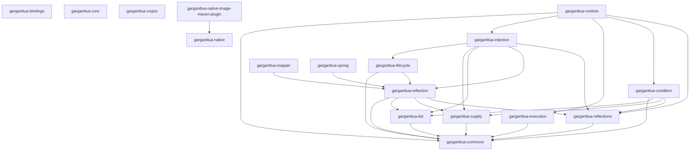

# 🧩 Garganttua Core

**Garganttua Core** is the foundation layer of the Garganttua ecosystem.
It provides modular, low-level building blocks for reflection, dependency injection, execution, mapping, encryption, and runtime management,
all designed for high performance, interoperability, and simplicity.

<!-- AUTO-GENERATED-START -->
### Installation with Maven
```xml
<dependency>
    <groupId>com.garganttua</groupId>
    <artifactId>garganttua-core</artifactId>
    <version>2.0.0-ALPHA01</version>
</dependency>
```

### Actual version
2.0.0-ALPHA01

### Dependencies
 - `org.junit.jupiter:junit-jupiter-engine:test`
 - `org.slf4j:slf4j-api:provided`
 - `org.projectlombok:lombok:provided`

<!-- AUTO-GENERATED-END -->

## 🧠 Architecture Overview

Garganttua Core is organized into independent modules, each focusing on a specific technical concern:

<!-- AUTO-GENERATED-ARCHITECTURE-START -->
| Module | Description |
|:--|:--|
| [**garganttua-core**](././README.md) |  |
| \|- [**garganttua-bindings**](./garganttua-bindings/README.md) | Modules providing bindings to external libs and frameworks. |
| \|    \|- [**garganttua-reflections**](./garganttua-bindings/garganttua-reflections/README.md) | Annotation scanner implementation based on org.reflections:reflections |
| \|    \|- [**garganttua-spring**](./garganttua-bindings/garganttua-spring/README.md) | Spring framework integration for Garganttua Core modules. |
| \|- [**garganttua-commons**](./garganttua-commons/README.md) | Shared components, interfaces, annotations, and exceptions. |
| \|- [**garganttua-condition**](./garganttua-condition/README.md) | DSL to define, combine, and evaluate runtime conditions. |
| \|- [**garganttua-crypto**](./garganttua-crypto/README.md) | Encryption, hashing, and secure key management utilities. |
| \|- [**garganttua-dsl**](./garganttua-dsl/README.md) | Declarative language and builder framework for Garganttua DSLs. |
| \|- [**garganttua-execution**](./garganttua-execution/README.md) | Task execution, orchestration, and fallback handling engine. |
| \|- [**garganttua-injection**](./garganttua-injection/README.md) | Dependency injection container with modular context support. |
| \|- [**garganttua-lifecycle**](./garganttua-lifecycle/README.md) | Abstract lifecycle management with thread-safe state transitions. |
| \|- [**garganttua-mapper**](./garganttua-mapper/README.md) | Declarative object-to-object mapping engine. |
| \|- [**garganttua-native**](./garganttua-native/README.md) | Low-level native integrations and system abstractions. |
| \|- [**garganttua-native-image-maven-plugin**](./garganttua-native-image-maven-plugin/README.md) | Maven plugin to build native images (GraalVM support). |
| \|- [**garganttua-reflection**](./garganttua-reflection/README.md) | Advanced reflection utilities for classes, methods, and annotations. |
| \|- [**garganttua-runtime**](./garganttua-runtime/README.md) | Runtime context management and lifecycle orchestration. |
| \|- [**garganttua-supply**](./garganttua-supply/README.md) | Object suppliers and contextual provisioning utilities. |


<!-- AUTO-GENERATED-ARCHITECTURE-STOP -->

## 🧭 Internal Dependencies

- All modules depend on [`garganttua-commons`](./garganttua-commons/README.md).
- High-level modules (`runtime`, `injection`, `bindings`) may depend on lower-level ones.
- Circular dependencies are strictly prohibited.
- Runtime and injection modules define the execution graph for all other components.

<!-- AUTO-GENERATED-DEPENDENCIES-GRAPH-START -->

<!-- AUTO-GENERATED-DEPENDENCIES-GRAPH-STOP -->

## License
This module is distributed under the MIT License.